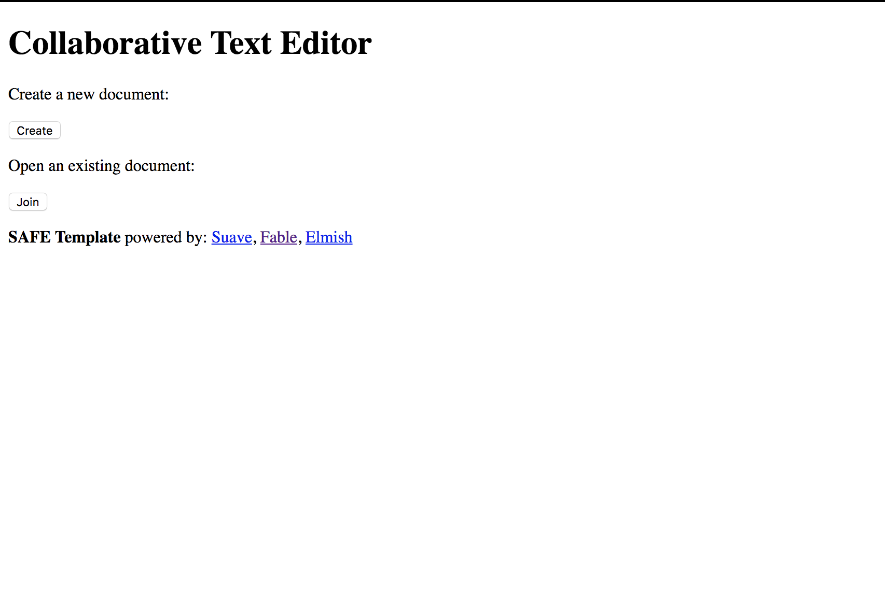
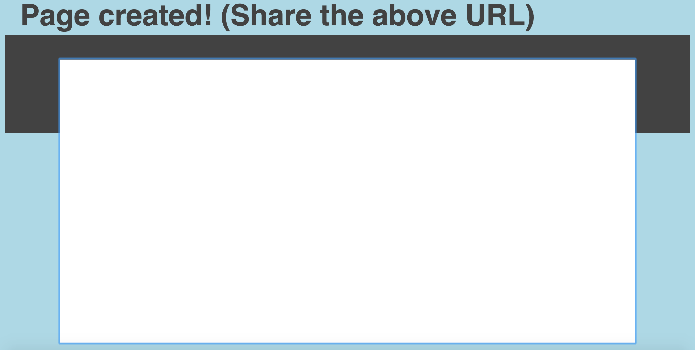
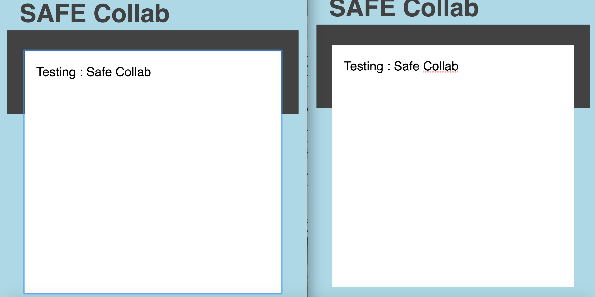

                                        CollaborativeTextEditor

An Online Text Edit Application using the SAFE stack where multiple people can collaborate at the same time.

                                        Installation Guide

Follow the instructions on this page to setup the SAFE environment: https://safe-stack.github.io/docs/quickstart/

Build Instructions:

1) To build the application run : build.cmd run(Windows) run ./build.sh run(Linux / OSX)
2) In the cs152project/src/Server/ directory run :
                                       a) "node install"   b) "node start" 

                                        Week 2 Update
                                        
   
   
   
   
                                        Week 3 Update
                                       

                                        
                                        
                                        

                                        Final Output
                                        
   

